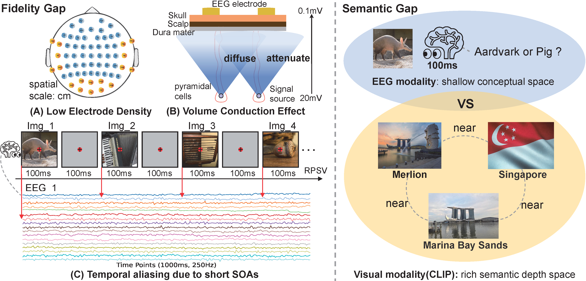
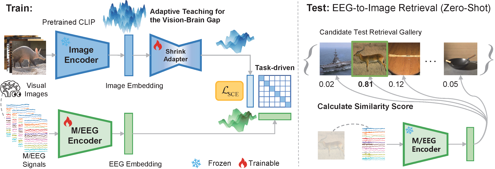

# Adaptive Teaching System (ATS)

## Table of Contents
  - [Introduction](#introduction)
  - [Repo Architecture](#repo-architecture)
  - [Environment Setup](#environment-setup)
  - [Data Preparation](#data-preparation)
  - [Run](#run)
  - [Acknowledgement](#acknowledgement)

## Introduction
This is the official implementation for [Shrinking the Teacher: An Adaptive Teaching Paradigm for Asymmetric EEG-Vision Alignment](AAAI 2026)

**Motivation:**
<p align="center">

</p>

**Overview:**
<p align="center">

</p>

## Repo Architecture
```
ATS/                           # Root directory
├── README.md
├── base                       # Core implementation files
│   ├── data.py                # Data loading
│   ├── eeg_backbone.py        # EEG encoder backbone implementation
│   ├── ShrinkAdapter.py       # Adapter backbone implementation
│   ├── inpating_data.py       # Inpainting data module for preprocessing
│   └── utils.py               # Utility functions
├── configs
│   └── ats.yaml               # Configuration for ATS experiments
├── draw_pic                   # Visualization for results
├── data                       # Directory for datasets
│   └── things-eeg
│       ├── Image_feature      # Pre-extracted image features
│       ├── Image_set          # Original image dataset
│       ├── Image_set_Resize   # Resized image dataset
│       ├── Preprocessed_data_250Hz_whiten # Preprocessed EEG data (whitened)
│       └── Raw_data
├── main.py                    # Main script for running experiments
├── shrinkadapter_1_4_downdim_768 # Directory of experiment results
├── preprocess
│   ├── process_eeg_whiten.py  # Script to preprocess and whiten EEG data
│   └── process_resize.py      # Script to resize image dataset
├── ats.yml                    # List of required Python packages
└── scripts
    ├── bash_preprocess.sh     # Bash script for preprocessing data
    └── train.sh               # Bash script for running experiments
```
## Environment Setup
- Python 3.8.19
- Cuda 12.2
- PyTorch 2.4.1
- Required libraries are listed in `ats.yml`.

```
conda env create -f ats.yml
```

## Data Preparation
1. Download the Things-EEG dataset from the [OSF repository](https://osf.io/anp5v/files/osfstorage) and put them in the `data` dir. Download the Things-MEG dataset from the [OSF repository](https://openneuro.org/datasets/ds004212/versions/3.0.0). Download the `images_THINGS` from [OSF repository](https://osf.io/jum2f/files/osfstorage).
   
    Recommendation: things.zip, things-eeg.zip, things-meg.zip is necessary, other files are optional.
2. Preprocessed data will be uploaded after acceptance, as the path information contained in the data may reveal personal information. The following scripts can process raw data into data usable for experiments.


3. Convert the data to .pt format using the preprocessing script for all subjects:

```
/bin/bash scripts/bash_preprocess.sh
```

3. Resize the downloaded images using the provided script:

```
python preprocess/process_resize.py --type eeg
python preprocess/process_resize.py --type meg
```

Finally, we have the directory tree:
```
├── data
    ├── things-eeg
        ├── Image_set
        ├── Image_set_Resize
        ├── Raw_data (optional)
        ├── Preprocessed_data_250Hz_whiten
    ├── things
        ├── THINGS
            ├── Images
            ├── Metadata
    ├── things-meg
        ├── Image_set
        ├── Image_set_Resize
        ├── ds004212-download (Raw_data, optional)
        ├── Preprocessed_data
```
## Run
To run the experiments using the provided configurations, execute:
```
/bin/bash scripts/train.sh
```

```
#!/bin/bash
# Training script for Adaptive Teaching System (ATS)
BRAIN_BACKBONE="Shared_Temporal_Attention_Encoder"
VISION_BACKBONE="RN50"
ADAPTOR_BACKBONE="ShrinkAdapter"
SUB="01"
SEED=0
TRAIN_BATCH_SIZE=150
EPOCH=150
LR=1e-4
LAMBDA_IMG2IMG=0.0
LAMBDA_IMG2EEG=0.0
LAMBDA_MMD=0.0
LAMBDA_MAP=0.0
EXP_SETTING="intra-subject"
DEVICE="cuda:0"
CONFIG="configs/ats.yaml"

python main.py \
    --config $CONFIG \
    --subjects sub-$SUB \
    --seed $SEED \
    --exp_setting $EXP_SETTING \
    --brain_backbone $BRAIN_BACKBONE \
    --vision_backbone $VISION_BACKBONE \
    --adaptor_backbone $ADAPTOR_BACKBONE \
    --epoch $EPOCH \
    --lr $LR \
    --device $DEVICE \
    --train_batch_size $TRAIN_BATCH_SIZE \
    --lambda_img2img $LAMBDA_IMG2IMG \
    --lambda_img2eeg $LAMBDA_IMG2EEG \
    --lambda_mmd $LAMBDA_MMD \
    --lambda_map $LAMBDA_MAP

```
`shrinkadapter_1_4_downdim_768` is the directory for ShrinkAdapter experiments results, which contains the configurations and results.
Since the `.ckpt` is too large, only the experimental results of sub-01 are retained, and the code can run perfectly.

## Acknowledgement
We acknowledge the contributions of the following datasets:
- [A large and rich EEG dataset for modeling human visual object recognition](https://www.sciencedirect.com/science/article/pii/S1053811922008758) [THINGS-EEG]
- [
THINGS-data, a multimodal collection of large-scale datasets for investigating object representations in human brain and behavior](https://pubmed.ncbi.nlm.nih.gov/36847339/) [THINGS-MEG]

Our code is built upon an awesome work [Bridging the Vision-Brain Gap with an Uncertainty-Aware Blur Prior](https://github.com/HaitaoWuTJU/Uncertainty-aware-Blur-Prior) [CVPR 2025] Thank you for your contributions!

The code is also inspired by prior awesome works on neural decoding tasks:
- [Decoding Natural Images from EEG for Object Recognition](https://github.com/eeyhsong/NICE-EEG) [ICLR 2024]
- [MB2C: Multimodal Bidirectional Cycle Consistency for Learning Robust Visual Neural Representations](https://github.com/leeh2213/MB2C) [ACM MM 2024]
- [CognitionCapturer: Decoding Visual Stimuli from Human EEG Signals with Multimodal Information.](https://github.com/XiaoZhangYES/CognitionCapturer/) [AAAI 2025]
- [Mind’s Eye: Image Recognition by EEG via Multimodal Similarity-Keeping Contrastive Learnings](https://github.com/ChiShengChen/MUSE_EEG)  [arXiv:2406.16910]

## Citation
If you find our work helpful, please cite:
```bibtex

}
```


## Contact us
For any additional questions, feel free to email lkwu@stu.xidian.edu.cn .
